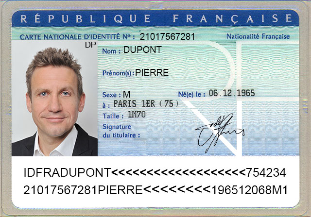

# Phase 2 | Codage

Inspiration du code : [dcode.fr CNI](https://www.dcode.fr/carte-identite-francaise)

Exemple du résultat attendu :

Pour :
- DUPONT
- JEAN
- 19/10/1983
- 95500
- homme

```
IDFRADUPONT<<<<<<<<<<<<<<<<<<<095123
2101095123451JEAN<<<<<<<<<<8310198M5
```

## Demo de CNI



Réponse de la banque :
```
Mr DUPONT

Votre compte est désormais ouvert et accessible en ligne
votre identifiant est votre numero de compte 21017567281
et votre mot de passe temporaire: challengepython

Cordialement
la Banque RDP
```

Banque => [Compte](http://univcergy.phpnet.org/scenario3/banque/)